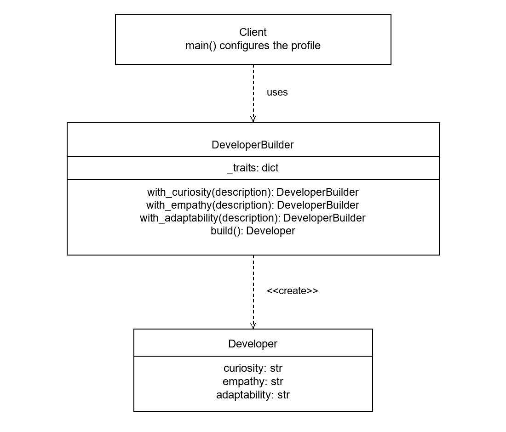
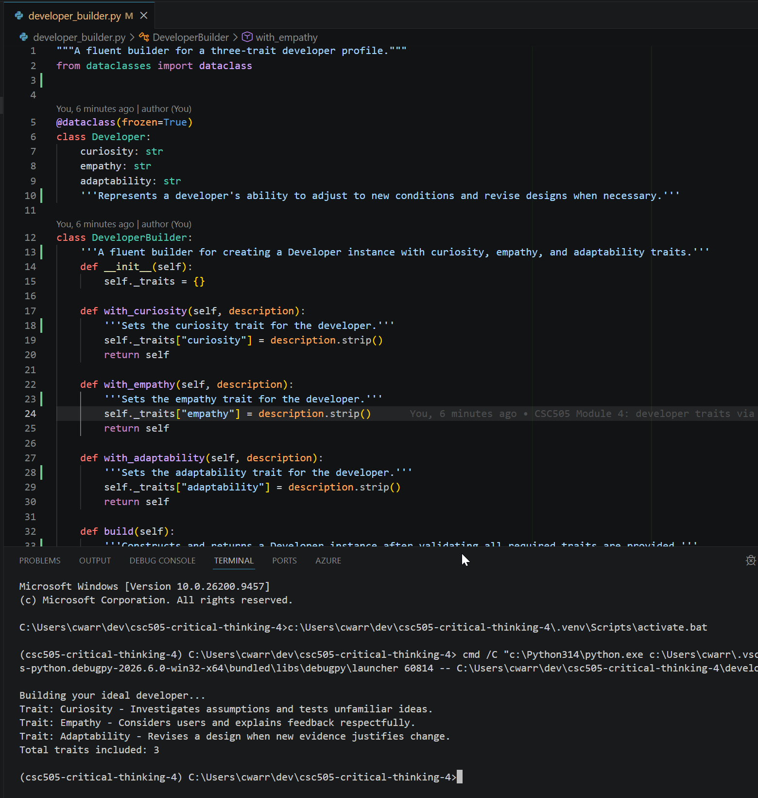

# Developer Traits and a Fluent Builder

CSC505 Module 4 Critical Thinking (CSC505_M04_CT)

This project models three personality traits commonly found in high-performing
developers, represents them in a UML class diagram structured after the Builder
design pattern, and simulates constructing a developer profile in Python using
a fluent builder.

## Developer Traits

The three traits represented are **curiosity**, **empathy**, and
**adaptability**. Each trait contributes to collaboration through observable
behavior, and the Python example uses descriptions rather than scores or claims
about a person's fixed ability.

### Curiosity

Curiosity encourages a developer to investigate an assumption before building
on it. For example, reproducing a reported defect and asking why it occurs can
reveal a misunderstood requirement. In a team, sharing that investigation
prevents different members from repeating the same incorrect assumption.

### Empathy

Empathy helps developers understand both users and colleagues. A reviewer can
explain the effect of a defect and suggest a correction without attacking the
author. Considering a user who is unfamiliar with the system also improves
labels, error recovery, and the choice of what information to show.

### Adaptability

Adaptability means revising a decision when evidence changes. A team may need
to replace an unsuitable library, adjust a requirement, or simplify a design
after a demonstration. The useful behavior is a reasoned change with an updated
explanation, rather than repeated changes without a clear purpose.

## Builder Design

Object Oriented Design (n.d.) describes Builder as separating the construction
process from the product representation. This compact example uses a fluent
concrete builder: each `with_` method records one trait and returns the
builder, and `build()` creates the `Developer` product. The client supplies the
construction sequence instead of introducing a separate Director class.

The `Developer` is immutable after construction. The builder validates that all
three descriptions exist, and later changes to the builder do not alter a
product already created.

## UML Class Diagram



Class relationships:

- `Client` to `DeveloperBuilder`: a `uses` dependency. `main()` configures
  the profile through the fluent interface.
- `DeveloperBuilder` to `Developer`: a `<<create>>` dependency. `build()`
  constructs and returns the immutable product.

The diagram shows a creation dependency, not inheritance, between the builder
and its product. The editable UMLet source is `developer_builder.uxf`.

## Running the Program

The project uses [uv](https://docs.astral.sh/uv/) with a local virtual
environment. Only the Python standard library is required (Python 3.10+).

```powershell
uv venv        # create the .venv virtual environment (first time only)
uv run python developer_builder.py
```

Without uv, run it directly:

```powershell
python developer_builder.py
```

### Expected Output

```text
Building your ideal developer...
Trait: Curiosity - Investigates assumptions and tests unfamiliar ideas.
Trait: Empathy - Considers users and explains feedback respectfully.
Trait: Adaptability - Revises a design when new evidence justifies change.
Total traits included: 3
```

### Successful Execution



## Project Files

| File | Purpose |
| --- | --- |
| `developer_builder.py` | Python script: `Developer` and its builder |
| `developer_builder.png` | UML class diagram export |
| `developer_builder.uxf` | Editable UMLet diagram source |
| `python_output_screenshot.png` | Screenshot of a successful run |
| `pyproject.toml` | uv project definition (stdlib only, 3.10+) |
| `README.md` | This document |

## Submission Contents

The zipped submission folder contains the Python script
(`developer_builder.py`), a screenshot of the script running successfully
(`python_output_screenshot.png`), and the UML class diagram
(`developer_builder.png`).

## References

Object Oriented Design. (n.d.). *Builder pattern*.
<https://www.oodesign.com/builder-pattern>
